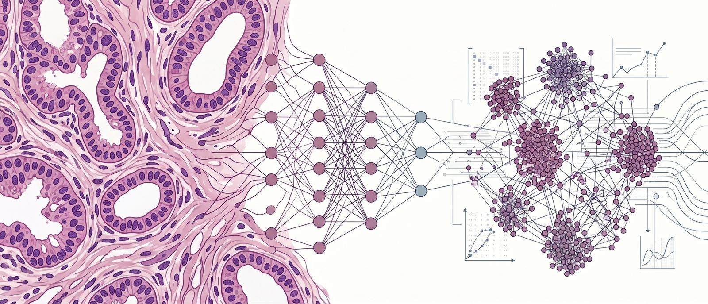

# Evaluación de alternativas de técnicas de preprocesamiento con Deep Learning para clasificación de imágenes histológicas en cáncer de mama



Repositorio del **Trabajo de Fin de Grado** centrado en la clasificación automática de lesiones mamarias histopatológicas a partir del dataset **BRACS**, mediante modelos de *Deep Learning*, modelos fundacionales y distintos análisis complementarios orientados a la interpretación de resultados.

---

## Autor

**Juan Carlos Mora**  
**Grado en Ingeniería Informática**  
**Universidad de Granada (UGR)**  
**Curso académico 2025–2026**

---

## Descripción general del proyecto

El cáncer de mama sigue siendo uno de los problemas oncológicos más relevantes a nivel mundial, y el análisis histopatológico desempeña un papel central en su diagnóstico. Este proyecto estudia la clasificación automática de subtipos de lesiones mamarias a partir del dataset **BRACS**, siguiendo un flujo de trabajo realista, reproducible y orientado tanto al rendimiento predictivo como a la interpretación de la incertidumbre.

A lo largo del proyecto se aborda el problema desde el nivel de **patch** hasta el nivel de **ROI**, incorporando además distintos bloques experimentales complementarios, entre ellos:

- comparación de familias de modelos baseline,
- uso de embeddings extraídos con modelos fundacionales,
- estrategias de limpieza y reducción de patches,
- agregación de predicciones a nivel de ROI,
- análisis de abstención en casos dudosos,
- análisis no supervisado del espacio latente,
- estudio basado en prototipos claros,
- y experimentos exploratorios de selección de características.

---

## Objetivos del repositorio

Este repositorio recoge:

- el código fuente desarrollado durante el proyecto,
- los scripts experimentales organizados por fases,
- la memoria del TFG,
- el código legado utilizado como referencia inicial,
- y la documentación mínima necesaria para comprender y reproducir el flujo experimental en la carpeta `docs/experiment_commands.md`.

---

## Resumen metodológico

El proyecto siguió una metodología de trabajo **iterativa, experimental y guiada por resultados**. En lugar de fijar desde el inicio un pipeline completamente cerrado, cada fase se fue refinando a partir de la evidencia obtenida en la anterior.

El flujo global del trabajo evolucionó a través de las siguientes etapas:

1. **Entrenamiento de modelos baseline a nivel de patch**, comparando CNNs, Vision Transformers y modelos fundacionales.
2. **Extracción de embeddings** a partir de los mejores modelos fundacionales.
3. **Limpieza de patches**, estudiando métodos como Información Mutua, RandomUnderSampler y NCR.
4. **Evaluación a nivel de ROI**, comparando distintas reglas de votación.
5. **Análisis de abstención**, permitiendo al sistema derivar a revisión las ROIs más inciertas.
6. **Bloques extra de análisis**, incluyendo clustering no supervisado, proyección a 3 clases y estudio por prototipos.
7. **Selección de características**, comparando Hy-index y mRMR sobre embeddings fundacionales.

---

## Resumen visual


---

## Estructura del repositorio

```text
tfg-bracs/
├── docs/                     # Documentación adicional del proyecto
├── legacy/                   # Código de referencia utilizado al inicio
├── memoria/                  # Memoria final y figuras asociadas
├── src/
│   └── bracs/
│       ├── data/             # Utilidades de datos, loaders y transformaciones
│       ├── experiments/
│       │   ├── baseline/                 # Entrenamiento baseline inicial a nivel de patch
│       │   ├── phase1_baseline/          # Embeddings y cabezas lineales
│       │   ├── phase2_patch_cleaning/    # Limpieza y reducción de patches
│       │   ├── phase3_roi_evaluation/    # Agregación patch→ROI y evaluación
│       │   ├── phase4_abstention/        # Abstención y análisis de casos dudosos
│       │   ├── phase5_extra_analysis/    # Clustering, prototipos y análisis extra
│       │   └── phase6_feature_selection/ # Hy-index y mRMR
│       └── utils/            # Rutas, semillas y utilidades auxiliares
├── pyproject.toml
├── README.md
└── requirements.txt
```

---

## Tecnologías utilizadas

- **Python**
- **PyTorch**
- **scikit-learn**
- **NumPy / pandas**
- **MLflow**
- **Matplotlib**
- **Git / GitHub**
- **Overleaf** (para la memoria)

---

## Código legado

La carpeta `legacy/tfm-nerea/` conserva el código de referencia utilizado al comienzo del proyecto para comprender mejor la estructura del dataset y el flujo experimental inicial. Se ha mantenido separada del desarrollo principal para distinguir claramente entre el material heredado y la implementación final realizada en este TFG. Autora: Nerea Hernández Carpintero (Mentora del proyecto).

---

## Memoria del proyecto

La memoria completa del TFG se encuentra en la carpeta `memoria/`. 

